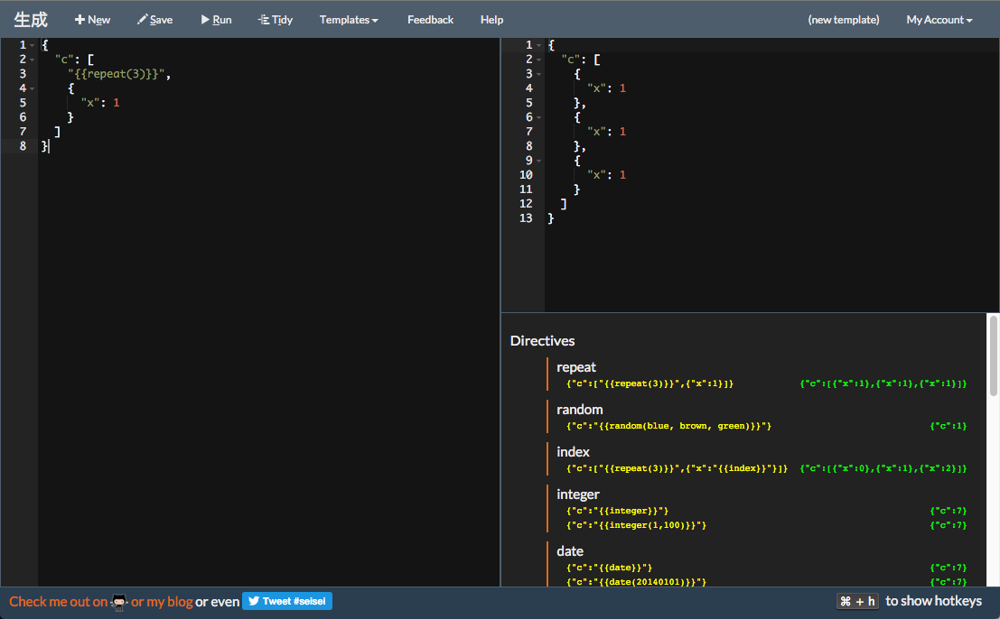

[](https://waffle.io/trevershick/seisei)
[](https://travis-ci.org/trevershick/seisei)

# Description
Seisei is a simple tool that allows you to specify a JSON template and statically or dynamically publish an endpoint that has CORS disabled which you can then use any way you see fit (within reason).  It's currently deployed at http://seisei.elasticbeanstalk.com and is free for general use.

I use this project as a means for learning.  It's written in Clojure on the backend and was originally Javascript/RiotJS on the front end.  I recently converted it to [ClojureScript](https://github.com/clojure/clojurescript) and [Om](https://github.com/omcljs/om) on the front end.  It's a non trivial application that's nice to use for testing technologies as it has...
* More than basic REST interface to the server (not just Todo)
* 3rd party components to integrate (Ace Editor)
* Multiple State / Reloading issues (renaming of template requires updates to template list, etc.)
* Modal Dialogs
* OAuth

... so it's more than just a todo list application that affords me many challenges when learning something new.

# Screen Shot


# Seisei Front End Architecture with [Om](https://github.com/omcljs/om)

I do not profess to be a wizard or any sort of higher order master of ze web.  I've worked with a lot of different front end techs over the years and one thing Flux got right was a single direction data flow.  I've implemented that data flow with [Om](https://github.com/omcljs/om) ([React](https://facebook.github.io/react/)) and [```core.async```](https://github.com/clojure/core.async) for the dispatcher.


# High Level Architecture


## Dependencies
**Requires Phantomjs** to be installed for the ClojureScript Tests.

**Requires AWS Environment Variables**

* GITHUB_OAUTH_CLIENT_ID=XXX
* GITHUB_OAUTH_SECRET=YYY
* AWS_S3_ACCESS_KEY=ZZZ
* AWS_S3_SECRET_KEY=AAA
* AWS_S3_BUCKET=<a bucket you've created>
* AWS_DYNAMODB_ACCESS_KEY=DDD
* AWS_DYNAMODB_ENDPOINT = https://dynamodb.us-east-1.amazonaws.com
* AWS_DYNAMODB_SECRET_KEY=EEE

## Building
```
lein full-build
```

```lein full-build``` does the following:
* clean
* bower install (a javascript or two)
* builds/tests
* creates documentation
* runs coverage

You can start the server in a couple of different ways.  For backend work, start via

```
source aws.env
lein ring server
```
or, if you're going to be doing front end work, then you might want to start the project with figwheel.

```
source aws.env
rlwrap lein figwheel
```
